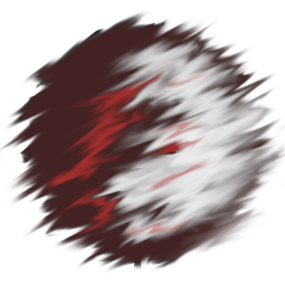

<h1 align="center">
	
	<br>
	Solenodon
</h1>

<h4 align="center">A <a href="https://golang.org/">Go</a> library for dealing with deserialized data for which the structure is dynamic or unknown.</h4>

<p align="center">
	<a href="https://godoc.org/github.com/macabot/solenodon">
		
	</a>
	<a href="https://travis-ci.org/macabot/solenodon">
		
	</a>
</p>

<p align="center">
	<a href="#installation">Installation</a> •
	<a href="#how-to-use">How to use</a> •
	<a href="#credits">Credits</a>
</p>

## Installation

```sh
go get github.com/macabot/solenodon
```

## How to use
Solenodon must be used in combination with a serialization library that is able to deserialize data into a tree structure of maps and slices given a target of type `interface{}`.

Supported:
- [encoding/json]
- [github.com/go-yaml/yaml]
- [github.com/BurntSushi/toml]

Unsupported:
- [encoding/xml] - because there is [no standard way](https://groups.google.com/d/msg/golang-nuts/zEmDOp_yFpU/my8RC0K-DQAJ) to map XML to a key-value structure.

[encoding/json]: https://golang.org/pkg/encoding/json/
[github.com/go-yaml/yaml]: github.com/go-yaml/yaml
[github.com/BurntSushi/toml]: github.com/BurntSushi/toml
[encoding/xml]: https://golang.org/pkg/encoding/xml/

### Example
The following shows an example of how to use the `Has`, `Get`, `Delete` and `Replace` method:
```go
raw := []byte(`{"foo":"bar","items":[2,3,{"i":6,"j":7}]}`)
container, err := solenodon.NewContainerFromBytes(raw, json.Unmarshal)
if err != nil {
	panic(err)
}
fmt.Println(container.Has("foo")) // true
fmt.Println(container.Get("foo").Data().(string)) // bar
container.Get("items", 2, "j").Replace(44)
container.Delete("items", 0)
b, err := json.Marshal(container.Data())
if err != nil {
	panic(err)
}
fmt.Println(string(b)) // {"foo":"bar","items":[3,{"i":6,"j":44}]}
```

You can find more examples [here](examples).

## Credits

This library was inspired by [gabs](https://github.com/Jeffail/gabs).
